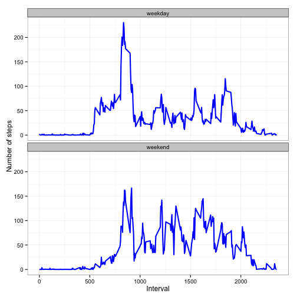

# Reproducible Research: Peer Assessment 1


## Loading and preprocessing the data

#### First, the data was loaded into "activity" table.


```r
library(ggplot2)
activity <- read.csv("activity.csv", header = T, colClasses = c("numeric", "character", 
    "numeric"))
activity$interval <- factor(activity$interval)
activity$date <- as.Date(activity$date, format = "%Y-%m-%d")
```


#### Next the "activity" data has been examined.


```r
summary(activity)
```

```
##      steps            date               interval    
##  Min.   :  0.0   Min.   :2012-10-01   0      :   61  
##  1st Qu.:  0.0   1st Qu.:2012-10-16   5      :   61  
##  Median :  0.0   Median :2012-10-31   10     :   61  
##  Mean   : 37.4   Mean   :2012-10-31   15     :   61  
##  3rd Qu.: 12.0   3rd Qu.:2012-11-15   20     :   61  
##  Max.   :806.0   Max.   :2012-11-30   25     :   61  
##  NA's   :2304                         (Other):17202
```

```r
str(activity)
```

```
## 'data.frame':	17568 obs. of  3 variables:
##  $ steps   : num  NA NA NA NA NA NA NA NA NA NA ...
##  $ date    : Date, format: "2012-10-01" "2012-10-01" ...
##  $ interval: Factor w/ 288 levels "0","5","10","15",..: 1 2 3 4 5 6 7 8 9 10 ...
```


## What is mean total number of steps taken per day?

#### Below is a histogram of the daily total number of steps taken each day with the mean and median of the total daily steps marked on the plot.


```r
calc_steps_per_day <- function(activity) {
    steps_per_day <- aggregate(steps ~ date, activity, sum)
    colnames(steps_per_day) <- c("date", "steps")
    steps_per_day
}

plot_steps_per_day <- function(steps_per_day, mean_steps, median_steps) {
    col_labels = c(paste("Mean:", mean_steps), paste("Median:", median_steps))
    cols = c("blue", "yellow")
    
    ggplot(steps_per_day, aes(x = steps)) + geom_histogram(fill = "#FF6666", 
        binwidth = 1000) + geom_point(aes(x = mean_steps, y = 0, color = "green"), 
        size = 5, shape = 20) + geom_point(aes(x = median_steps, y = 0, color = "yellow"), 
        size = 5, shape = 20) + scale_color_manual(name = element_blank(), labels = col_labels, 
        values = cols) + labs(title = "Histogram of Steps taken per day", x = "Number of Steps", 
        y = "Count") + theme_bw() + theme(legend.position = "bottom")
}

steps_per_day <- calc_steps_per_day(activity)
mean_steps = round(mean(steps_per_day$steps), 2)
median_steps = round(median(steps_per_day$steps), 2)
plot_steps_per_day(steps_per_day, mean_steps, median_steps)
```

 


#### For the mean and median total number of steps taken per day:
- **Mean: 10766.19**
- **Median: 10765**


## What is the average daily activity pattern?

#### Below is a time-series plot of the average daily pattern of the number of steps plotted of 5 minutes interval. The interval that had the maximum number of steps on the average is marked.


```r
calc_steps_per_interval <- function(activity) {
    steps_per_interval <- aggregate(activity$steps, by = list(interval = activity$interval), 
        FUN = mean, na.rm = T)
    # convert to integers for plotting
    steps_per_interval$interval <- as.integer(levels(steps_per_interval$interval)[steps_per_interval$interval])
    colnames(steps_per_interval) <- c("interval", "steps")
    steps_per_interval
}

plot_activity_pattern <- function(steps_per_interval, max_step_interval) {
    col_labels = c(paste("Interval with maximum activity: ", max_step_interval))
    cols = c("red")
    
    ggplot(steps_per_interval, aes(x = interval, y = steps)) + geom_line(color = "black", 
        size = 1) + geom_point(aes(x = max_step_interval, y = 0, color = "red"), 
        size = 5, shape = 25) + scale_color_manual(name = element_blank(), labels = col_labels, 
        values = cols) + labs(title = "Average Daily Activity Pattern", x = "Interval", 
        y = "Number of steps") + theme_bw() + theme(legend.position = "bottom")
}

steps_per_interval <- calc_steps_per_interval(activity)
max_step_interval <- steps_per_interval[which.max(steps_per_interval$steps), 
    ]$interval

plot_activity_pattern(steps_per_interval, max_step_interval)
```

 


#### The **835<sup>th</sup> interval** has the maximum activity on the average.


## Imputing missing values

#### To fill in the missing values, the criteria chosed to replace them is the mean value at the same interval across days due to the assumption that the activities usually follow a daily pattern.


```r
imp_means <- function(activity, defaults) {
    na_indices <- which(is.na(activity$steps))
    defaults <- steps_per_interval
    na_replacements <- unlist(lapply(na_indices, FUN = function(idx) {
        interval = activity[idx, ]$interval
        defaults[defaults$interval == interval, ]$steps
    }))
    imp_steps <- activity$steps
    imp_steps[na_indices] <- na_replacements
    imp_steps
}
activity_with_impute_data <- data.frame(steps = imp_means(activity, steps_per_interval), 
    date = activity$date, interval = activity$interval)
```


#### Summarizing the new dataset with imputed values:

```r
summary(activity_with_impute_data)
```

```
##      steps            date               interval    
##  Min.   :  0.0   Min.   :2012-10-01   0      :   61  
##  1st Qu.:  0.0   1st Qu.:2012-10-16   5      :   61  
##  Median :  0.0   Median :2012-10-31   10     :   61  
##  Mean   : 37.4   Mean   :2012-10-31   15     :   61  
##  3rd Qu.: 27.0   3rd Qu.:2012-11-15   20     :   61  
##  Max.   :806.0   Max.   :2012-11-30   25     :   61  
##                                       (Other):17202
```


#### With the imputed dataset, below is a histogram of the daily total number of steps taken, plotted with the mean and median of the daily total steps mared on the plot.


```r
imputed_steps_per_day <- calc_steps_per_day(activity_with_impute_data)
imputed_mean_steps = round(mean(imputed_steps_per_day$steps), 2)
imputed_median_steps = round(median(imputed_steps_per_day$steps), 2)
plot_steps_per_day(imputed_steps_per_day, imputed_mean_steps, imputed_median_steps)
```

 


#### Comparing with the calculations done in the first section of this document, the observation is that the mean value remains unchanged but the median value has shifted closer to the mean.


## Are there differences in activity patterns between weekdays and weekends?

#### These are the steps done to the table with filled-in missing values.

1. Augment the table with a column indicating the day of the week
2. Subset the table into weekends (SAT and SUN) and weekdays (MON through FRI).
3. Tabulate the average steps per interval for each dataset.
4. Plot the two datasets side by side for comparison.


```r
calc_day_of_week_data <- function(imputed_activity) {
    imputed_activity$weekday <- as.factor(weekdays(imputed_activity$date))
    weekend_data <- subset(imputed_activity, weekday %in% c("Saturday", "Sunday"))
    weekday_data <- subset(imputed_activity, !weekday %in% c("Saturday", "Sunday"))
    
    weekend_step_pi <- calc_steps_per_interval(weekend_data)
    weekday_step_pi <- calc_steps_per_interval(weekday_data)
    
    weekend_step_pi$dayofweek <- rep("weekend", nrow(weekend_step_pi))
    weekday_step_pi$dayofweek <- rep("weekday", nrow(weekday_step_pi))
    
    day_of_week_data <- rbind(weekend_step_pi, weekday_step_pi)
    day_of_week_data$dayofweek <- as.factor(day_of_week_data$dayofweek)
    day_of_week_data
}
plot_day_of_week_comparison <- function(day_of_week_data) {
    ggplot(day_of_week_data, aes(x = interval, y = steps)) + geom_line(color = "blue", 
        size = 1) + facet_wrap(~dayofweek, nrow = 2, ncol = 1) + labs(x = "Interval", 
        y = "Number of steps") + theme_bw()
}
day_of_week_data <- calc_day_of_week_data(activity_with_impute_data)
plot_day_of_week_comparison(day_of_week_data)
```

 


#### The observation between the activity on the weekends and weekdays is that they are quite similar pattern.  The weekends a bit tends to be more spread out over the day compared to the weekdays. The peak is not that high compared to the weekdays activity. This could be that the weekends tends to be more relaxed than the weekdays.


### This reported prepared by Veerasak Kritsanapraphan (veerasak.kritsanapraphan@gmail.com)


